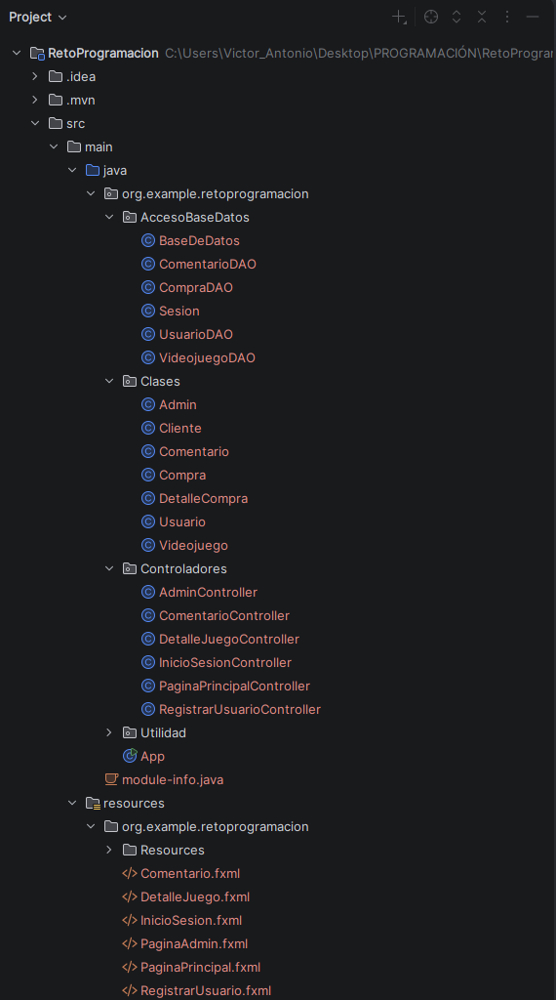
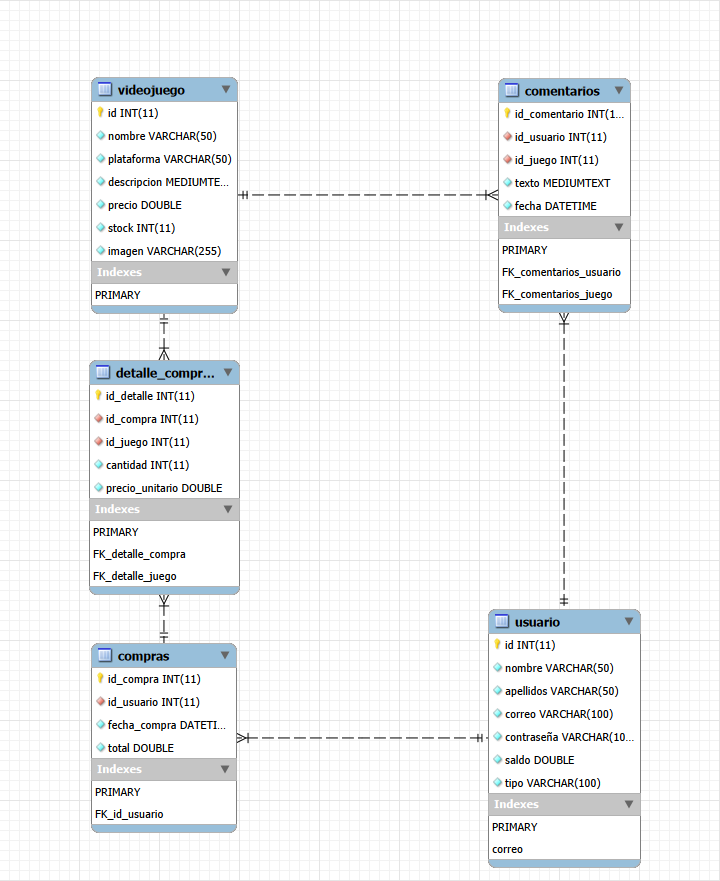
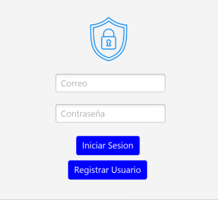
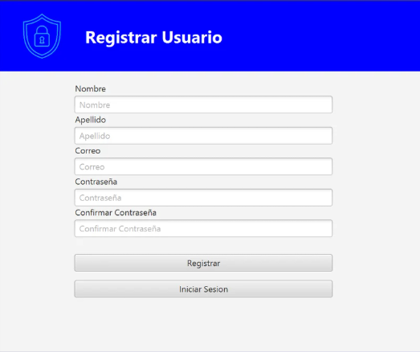
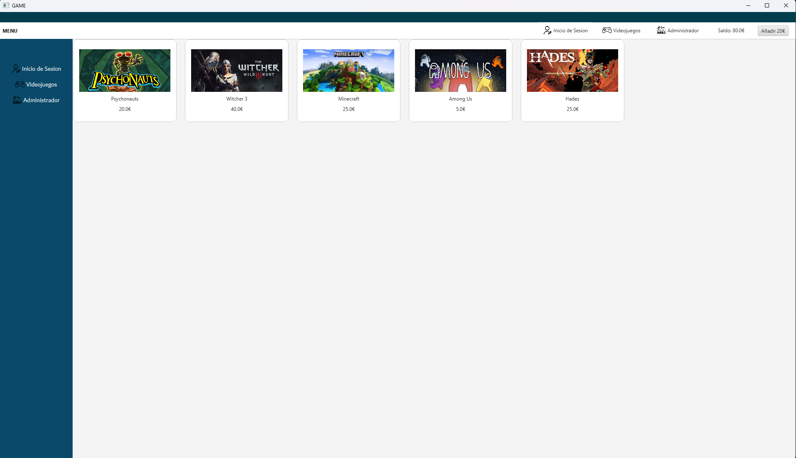
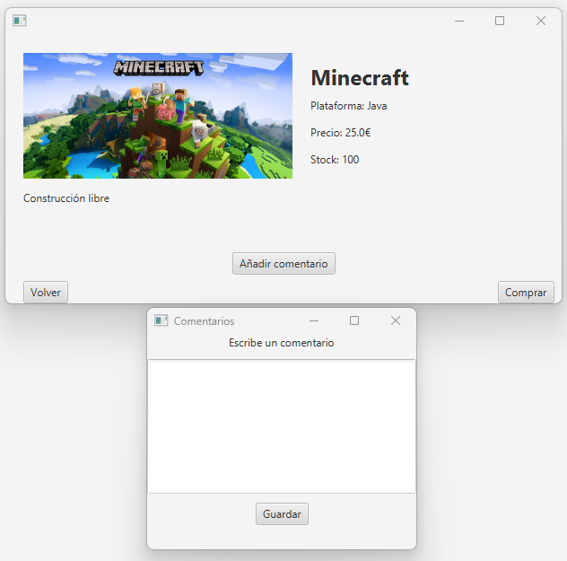
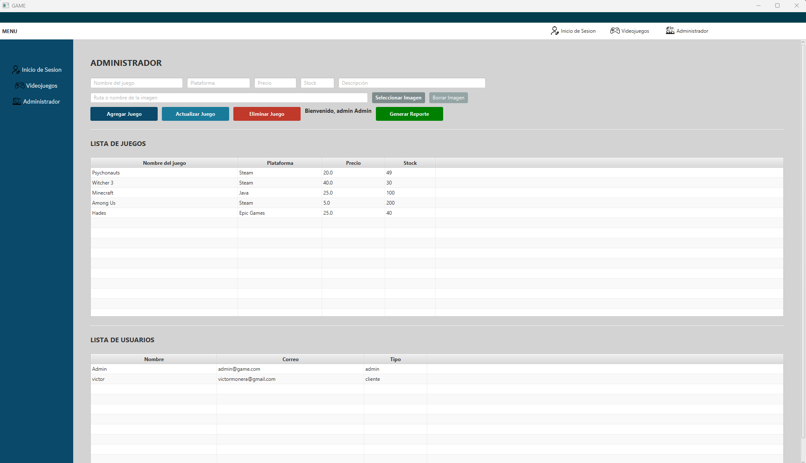

# Reto-5-Practica01-Generar-Documentacion-en-Markdown

# 1.Explicacion

El proyecto que he ralizado en Progrmacion consiste en una aplicacion para comprar videojuegos y dejar tus comentarios, pudiendo haber 2 tipos de usuarios (Cliente y Administrador).  
El cliente es el usuario normal que solo puede añadir dinero, comprar y dejar un comentario y el administrador puede editar los videojuegos que se venden, ya sea editarlos, eliminarlos  
o añadirlos.

# 2.Estructuración del código

## Explicación de la estructura

El proyecto sigue una arquitectura organizada en paquetes que separan claramente las responsabilidades de acceso a datos, lógica de negocio, controladores y recursos de interfaz.

### 📁 Paquetes principales

- **AccesoBaseDatos**: Contiene las clases encargadas de la conexión y operaciones con la base de datos (DAO).
- **Clases**: Define las entidades del negocio (modelos) como Usuario, Videojuego, Compra, etc.
- **Controladores**: Implementa la lógica de control de la aplicación, gestionando las interacciones entre la vista y el modelo.
- **Utilidad**: Contiene la clase principal `App`.
- **resources**: Contiene los archivos FXML que definen las interfaces de usuario.

### 🧠 Beneficios de esta estructura

- Separación de responsabilidades.
- Código más mantenible y escalable.
- Facilita el trabajo en equipo.
- Permite futuras expansiones sin afectar otras capas del sistema.

# 3.Base de datos del proyecto

La aplicación utiliza una base de datos relacional para gestionar los usuarios, videojuegos, compras y comentarios.  
La estructura está diseñada para mantener correctamente las relaciones entre las distintas entidades del sistema.

### 📦 Tablas principales

#### 🎮 videojuego
Almacena la información de los videojuegos disponibles en la tienda.

Campos principales:
- `id`: identificador del videojuego.
- `nombre`: nombre del videojuego.
- `plataforma`: plataforma del juego.
- `descripcion`: descripción del videojuego.
- `precio`: precio de venta.
- `stock`: cantidad disponible.
- `imagen`: ruta de la imagen del videojuego.

---

#### 👤 usuario
Contiene los datos de los usuarios registrados.

Campos principales:
- `id`: identificador del usuario.
- `nombre` y `apellidos`.
- `correo`: email del usuario.
- `contraseña`: contraseña de acceso.
- `saldo`: dinero disponible para comprar.
- `tipo`: define si es Cliente o Administrador.

#### 🛒 compras
Guarda las compras realizadas por cada usuario.

Relaciones:
- Un usuario puede realizar muchas compras.
- Cada compra pertenece a un único usuario.

Campos:
- `id_compra`
- `id_usuario`
- `fecha_compra`
- `total`

---

#### 📄 detalle_compra
Tabla intermedia que almacena los videojuegos incluidos en cada compra.

Relaciones:
- Una compra puede contener varios videojuegos.
- Un videojuego puede aparecer en muchas compras.

Campos:
- `id_detalle`
- `id_compra`
- `id_juego`
- `cantidad`
- `precio_unitario`

#### 💬 comentarios
Almacena los comentarios que los usuarios escriben sobre los videojuegos.

Relaciones:
- Un usuario puede escribir muchos comentarios.
- Un videojuego puede tener muchos comentarios.

Campos:
- `id_comentario`
- `id_usuario`
- `id_juego`
- `texto`
- `fecha`

---

---

### 🔗 Relaciones principales

- `usuario → compras` : relación 1 a muchos.
- `compras → detalle_compra` : relación 1 a muchos.
- `videojuego → detalle_compra` : relación 1 a muchos.
- `usuario → comentarios` : relación 1 a muchos.
- `videojuego → comentarios` : relación 1 a muchos.

### ✅ Beneficios de esta estructura

- Evita duplicidad de datos.
- Mantiene la integridad de la información.
- Facilita consultas y mantenimiento.
- Permite ampliar funcionalidades fácilmente.

# 4.Funcionamiento del programa.

## 4.1.Inicio de Sesion.

### Pasos a seguir

- Ventana principal cuando se inicia la aplicacion.
- Sirve para iniciar sesion y entrar en la pagina principal.
- Si no tienes cuenta, dale al boton de iniciar sesion y te mandara a la pagina de Registrar Usuario.

## 4.2.Registrar Usuario.

### Pasos a seguir

- Pestaña que sirve para registrar usuario, una vez introducidos los datos correctamente.
- Una vez registrado correctamente, te mostrara un mensaje de que se ha creado el usuario.
- Tener cuidado, tienes que cumplir el regex del correo.
- Una vez registrado el usuario hay que darle al boton de inicio de sesion.

## 4.3 Pagina Principal.

### Pasos a seguir

- Pestaña que sirve para comprar videojuegos y dejar tu comentario sobre ellos.
- Puedes añadir 20€ con el boton de arriba derecha. 
- Se actualiza tu saldo ya sea cuando añades dinero o cuando compras un juego.
- Si quieres iniciar sesion con otro usuario puedes darle a cualquier boton donde pone Inicio de Sesion.
- Para comprar un juego hay que darle clic y se abrira una ventana (Explicación en el punto 4.4).

## 4.4 Ventana emergente de los videojuegos.

### Pasos a seguir

- Ventana que se despliega al darle clic a un juego.
- Puedes comprar y se actualiza tu dinero actual. 
- El stock del videojuego una vez compres uno se actualiza.
- Cuando quieres poner un comentario, solo tienes que darle al boton de añadir comentario,  
lo escribes y le das a Guardar.  
- Ya sea tanto comprar como poner un comentario, se guardan en ficheros .txt  
para despues poder hacer informes con esa información.

## 4.5 Ventana del Administrador.

### Pasos a seguir

- Ventana que sirve para controlar los usuarios y videojuegos que hay.
- Puedes añadir, actualizar y eliminar videojuegos. 
- Para Añadir Videojugo correctamente tienes que darle clic a un juego, una vez dado clic le das al  
boton de añadir y se añadira una copia de el mismo, con esa copia la editas  
y pones el videojuego que quieras.
- `IMPORTARNTE` Cuando quieres, ya sea editar o crear un videojuego nuevo  
cuando cambias la informacion en los campos de arriba, tienes que darle al  
boton de actualizar para que los cambios se hagan correctamente.  
- Puedes generar un Reporte, que crea un documento .txt con la informacion de:
    - El juego mas vendido.
    - Total de ingresos.
    - Total de juegos Vendidos.  

